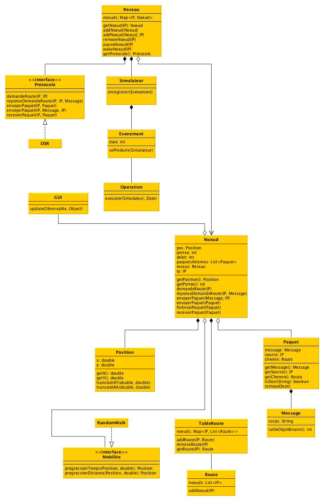

#Rapport d'analyse
__Groupe 34__ : Guillaume Defrances, Ilias Driouich, Abdelmalek Lamine, Thibault Meunier

[TOC]

##Introduction
###Présentation du sujet
Le sujet concerne la modélisartion d'un réseau ad-hoc ainsi que la gestion de celui-ci par l'intermédiaire d'une interface graphique.
###Choix réalisés
Au cours de l'étude de l'énoncé, il nous est apparu utile de préciser certains points.

####Création d'un réseau
Nous avons défini le réseau comme un ensemble de noeuds, et dans le cas présent comme l'intégralité des noeuds créés sur la carte. Il est le seul à connaitre la répartition spatiale des noeuds.

####Dimension de la carte
La carte est l'ensemble des positions autorisée pour les noeuds. Afin de simplifier la gestion de l'interface graphique, ainsi que le positionnement des noeuds sur celle-ci, nous limiterons la carte à une grille de 100 par 100. Un noeud qui traverserait la carte en un bord se retrouverait du coté opposé.

####Gestion des évènements
Lors de la gestion des évènements, deux possibilités se sont offertes à nous : faire une interface dynamique où les noeuds informent directement l'interface graphique de leur déplacement, ou une interface rafraichie dans laquelle l'interface graphique se basent sur les évènements du simulateur. Nous avons retenu la deuxieme solution du fait de la gestion facilitée de la parallélisation des évènements.

####Format du paquet
En ce qui concerne la structure des paquets, elle entre en compte dans la simulation par divers parametres. L'un des principaux est le codage de l'information ainsi que du noeud source et de la route. Nous avons décidé de ne pas stocker l'information de facon binaire, mais de créer une fonction permettant de l'estimer. Ainsi nous pouvons simplement avoir accès à la source et la route en stockant l'information dans un message.

##Structure du projet
###Diagramme de classe métier

###Description des classes
####Reseaux
+ __Despription__
Contient l'intégralité des noeuds du réseau et gère leurs interactions. Intermédiaire entre le simulateur et les noeuds.
+ __Jeux de tests__
 + Ajout/Suppression/Pause d'un noeud
 + Envoie d'un paquet aux noeuds a proximite
 + Information du simulateur des évènements en cours
+ __Planification__
Vendredi 3 Juin

####Protocole
+ __Despription__
Interface reprenant les fonctions necessaires a l'implementation d'un protocole de niveau reseau.
+ __Planification__
Vendredi 27 Mai

####DSR
+ __Despription__
Implementation du protocole DSR
+ __Jeux de tests__
 + Demande/réponse de route
 + Envoi/réception d'un paquet
 + Respect des contraintes des noeuds
+ __Planification__
Vendredi 27 Mai

####Simulateur
+ __Despription__
Ensemble d'opérations ordonnée par date
+ __Jeux de tests__
 + bonne éxécution d'un évènement et suppression
 + ajout d'un evenement
 + Information de l'interface graphique
 + Plusieurs evenement a la meme date
 + Taux de rafraichissement de 10ms
+ __Planification__
Vendredi 27 Mai

####Evenement
+ __Despription__
Operation a éxécuter à une date donnée. Peut etre mise dans un simulateur
+ __Jeux de tests__
 + se produit a la bonne date
+ __Planification__
Vendredi 27 Mai

####Operation
+ __Despription__
Fonction à exécuter à une certaine date
+ __Jeux de tests__
 + Execution de l'operation a la bonne date
+ __Planification__
Vendredi 27 Mai

####Noeuds
+ __Despription__
Modélisation d'une machine intégrée dans un ou plusieurs réseaux capable d'émettre et de recevoir des paquets
+ __Jeux de tests__
 + Demande de route effectuée si destinataire absent
 + Gestion des paquets en transit (actualisation du chemin)
 + Gestion de la file d'attente
 + Verification du debit sortant 
 + Envoi des informations au reseau (creation, envoi, ...)
+ __Planification__
Vendredi 3 Juin

####TableRoute
+ __Despription__
Table de routage
+ __Jeux de tests__
 + Mise a jour de la table avec une nouvelle route
 + Ajout d'une route
 + Recuperation de la route
+ __Planification__
Vendredi 27 Mai

####Route
+ __Despription__
Suite de noeuds
+ __Jeux de tests__
 + Contient les bons noeuds
 + Ajout d'un noeud a la fin de la route
+ __Planification__
Vendredi 27 Mai

####Paquet
+ __Despription__
Encapsule un message connaissant une source et une Route
+ __Jeux de tests__
 + Taille du paquet en bits
 + Fragmentation du paquet et reconstitution du Message
+ __Planification__
Vendredi 27 Mai

####Message
+ __Despription__
Contient les informations a transmettre sous forme binaire
+ __Jeux de tests__
 + Message contenant bien l'information convertie
+ __Planification__
Vendredi 27 Mai

####Mobilite et sous-classes
+ __Despription__
Interface dont les implémentations réalisent le déplacement de noeuds
+ __Jeux de tests__
-- Avance avec la vitesse indique
+ __Planification__
Vendredi 3 Juin

###Interface Graphique
####Description

Deux parties seront clairement distinctes :

+ les menus de controles, située dans la partie superieure de la fenetre graphique
+ la carte permettant de visulaliser les noeuds et les paquets qu'ils échangent

Un noeud pourra etre selectionne et l'utilisateur interagirera avec a l'aide du menu "Selection". Il aura ainsi la possibilite de retirer le noeud du reseau, de connaitre ses paquets, le mettre en pause, ... Si le temps le permet, ce menu sera integre directement dans le visuel de la carte, flottant au dessus du noeud selectionne.
La carte permettra de suivre les paquets dans le reseau et la repartition spatiale des noeuds au cours du temps. Il sera possible de visualiser rapidement les noeuds en cours d'emission, ainsi que les paquets fragmentes par differentes couleurs et logos apparaissant sur la carte.

####Planification
 + __Menus + Carte__ : Vendredi 27 Mai
 + __Carte avec noeuds + visualisation des paquets__ : Vendredi 3 Juin
