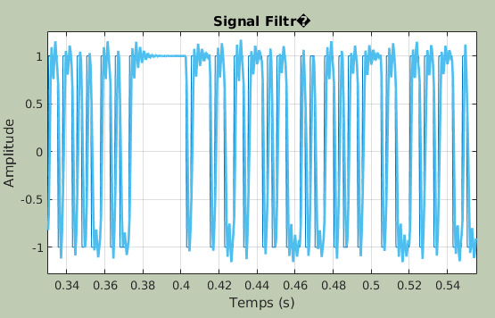

# TP2 : Filtrage numerique

## 1. Analyse des methodes de synthese de filtres numeriques
L'objectif de cette première partie du TP est de vous permettre d'analyser les differentes méthodes de synthèse des filtres numériques, en observant le comportement de filtres déjà programmés.

Lancer `filtnum` sous MATLAB. 
Cette commande permet d'afficher un gabarit de reponse frequentielle souhaitee, et d'afficher la reponse impusionnelle reelle du filtre en fonction de la fenetre utilisee.
On joue ainsi sur : 
- L'ordre du filtre
- Les oscillations
- L'importance de la pente

### 1. 1. Gabarit
Le gabarit du filtre est défini par l'utilisateur parmi les quatre catégories suivantes :
- Filtre passe-bas
- Filtre passe-haut
- Filtre coupe-bande
- Filtre passe-bande
On peut rêgler F\_e la fréquence d'échantillonnage, ∆f la largeur de la zone de transition, δ\_1 l'amplitude des ondulations en bande passante et δ\_2 l'amplitude des oscillations en bande atténuée figure 8.1).


### 1. 2. Filtre a Reponse Impulsionelle Finie (RIF)
#### Evaluation de l'ordre
Un ordre automatique est determine a partir des caracteristiques attenduessss :
- F\_e, 
- ∆f
- δ\_1
- δ\_2

#### Influence de la fenetre
Les differentes fenetres permettent de jouer sur :
- L'amplitude de oscillation
- La raideur de la pente

Le temps de propagation de groupe est toujours constant (mais ne possede pas la meme valeur) du fait de la linearite de la phase.

#### Influence de l'ordre
**Ordre optimal**: ordre minimal tel que le gabarit fréquentiel soit respecté.

La raideur de la pente augmente avec l'ordre. Ainsi, on peut continuer a augmenter l'ordre apres l'optimal pour permettre une coupure plus nette.

#### Reponse impulsionnelle
On regarde la reponse a une impulsion.
Pour creer le signal via MatLab, on utilise la fonction
```matlab
filter([b_0, b_1, ...], [a_0, a_1, ...], [x_0, x_1, ...])
```

Pour un filtre RIF, on prend `[a_0, a_1, ...] = [1]`
On peut ainsi directement lire les differents coefficients comme les amplitudes de la reponse impulsionnelle echantillonnee.


Pour determiner le temps de propagation de groupe, on mesure le decalage temporel entre un pic/zero du signal en entree et le meme sur le signal en sortie.

#### Filtrage d'un signal
##### Bruit Blanc (AWGN)
Quel que soit le filtrage (passe bas, haut, ...), on ne remarque pas de difference significative. En effet, le spectre est uniforme.

##### Signal NRZ
###### Passe-bas

Les discontinuites sont moins marques mais le signal reste identifiable. En effet, le filtrage a conserve les frequence presentant le maximum de puissance.

###### Passe-haut

Le signal n'est plus identifiable. On a supprimer les frequences representant le maximum de puissance.

###### Coupe-bande / Passe-bande
Les resultats sont similaires au passe-bas / passe-haut.

###### Retard
On peut sur chacun des filtres observer l'existance d'un retard. Celui-ci est du au temps de traitement du filtre.

### 1. 3. Filtres a Reponse Impulsionnelle Infinie (RII)
Les modèles analogiques qui peuvent être utilisés dans ce TP pour synthétiser des RII sont les modèles de Butterworth, de Chebychev I et Chebyshev II et elliptique.

#### Synthese en utilisant un modele de Butterworth
De meme aue pour les filtres RIF, il existe une formule permettant de determiner un ordre optimal approche en fonction des caracteristiques du filtre et des caracteristiques attendues.

##### Influence de l'ordre sur la pente de la zone de transition
Comme pour les filtres RIF, la pente augmente avec l'ordre.
Il n'est pas non plus necessaire de monter a des ordres aussi importants que pour les filtres RIF pour tenir convenablement dans le gabarit fixe.

##### Influence de l'ordre sur le temps de propagation de groupe
Cependant, cette reponse impulsionelle correcte a faible ordre a un cout : l'augmentation du temps de propagation de certaines frequences avec l'ordre.
Ceci peut nuire a la bonne restitution d'un signal, ou une mauvaise identification.

#### Synthese en utilisant un modele de Tchebychev
##### Difference entre Chebychev I et Chebychev II
La difference majeure entre ces deux filtres reside dans le traitement inegal apporte au oscillation.
Quand Chebychev I privilegiera une reponse lisse en haute frequence, Chebychev II le fera a basse frequence.

##### Influence de l'ordre
Comme dit precedement, l'ordre augmente le temps de propagation.
Toutefois, il n'ameliore plus la pente au dela d'un certain ordre car il cree des oscillations parasites.

#### Comparaison
La methode elliptique est optimal car : 
- parfaitement adaptee aux dimensions du gabarit
- presentant une pente nette
- ne possedant pas d'oscillation en hautes frequences

Cependant, c'est egalement la methode qui presente le temps de propagation de groupe le plus important : "On n'a rien sans rien"

#### Filtrage d'un signal
On ne s'interessera qu'au signal NRZ

On constate une asymetrie apparente du signal en sortie. Ceci est du au fait que le temps de propagation de groupe ne soit pas constant.
Cela explique egalement les oscilations au niveau des discontinuites.

### 1. 4. Conclusion
```bash
    Critere    |     RIF     |          RII
======================================================
  Maitrise de  |             |
   la phase    |     Oui     |          Non
-------------------------------------------------------
  Complexite   | Tres faible |         Faible
-------------------------------------------------------
   Stabilite   |  Toujours   | Fonction de la precision
-------------------------------------------------------
   Nombre de   |             |
 coefficients  |    Eleve    |         Faible
  necessaires  |             |
-------------------------------------------------------
Precision pour |             |
  les calculs  |   Moyenne   |         Grande
-------------------------------------------------------
   Adapte au   |             |
 multi-cadence |     Oui     |          Non
```

## 2. Realisation d'un modem de frequence
L'objectif de cette deuxième partie du TP est de vous permettre de réaliser sous Matlab un modem (modulateur/démodulateur) de fréquence simplifié.
Comme le montre la figure 8.2, la modulation de fréquence (ou modulation FSK : Frequency Shifit Keying) revient à générer un signal sinusoïdal prenant
la fréquence `F_1` ou `F_0` selon la séquence binaire à transmettre. Un bit 0 sera transmis sous la forme d'un morceau de cosinus de `N_s = 100` échantillons à la frequence `F_0 = 4080 Hz` , tandis qu'un bit 1 sera transmis sous la forme d'un
morceau de cosinus de `N_s = 100` echantillons a la frequence `F_1 = 980 Hz`.
La fréquence d'échantilonnage `F_e` sera prise égale à `48000 Hz`.

Tout est decrit dans le code Matlab suivant (`tp2.m`):
```matlab
%Realisation d'un modulateur/demodulateur de frequences simplifie
%Fichier a completer
%Fevrier 2011

clear all;
close all;

%Parametres
Fe=48000;   %Frequence d'echantillonnage
F0=980;     %Frequence du cosinus representant le bit 0
F1=4080;    %Frequence du cosinus representant le bit 1
Ns=100;     %Nombre de points par symbole physique 
            %associe e un bit e transmettre
SNR_dB=100; %SNR souhaite donne en dB

%Generation de la suite de bits 0, 1 correpondant au texte e envoyer
X = str2bin('H');

%Generation de deux morceaux de cosinus comprenant Ns echantillons :
%cos0 pour coder le bit 0, de frequence F0=980
cos0=cos(2*pi*F0/Fe*[0:100]);
%cos1 pour coder le bit 1, de frequence F1=4080
cos1=cos(2*pi*F1/Fe*[0:100]);

%Modulation FSK : on remplace chaque bits 0 et 1 par un morceau de cosinus
%cos0 ou cos1
signal=kron(X.',cos1)+kron(abs(X.'-1),cos0);

%Puissance du signal Ps=E(|signal(t)|²)
Ps=mean(abs(signal).^2);

%Trace du signal
hold on;
abscisse = linspace(0, 1/Fe, length(signal));
plot(abscisse, signal);

%Canal : ajout de bruit, le SNR est fixe en dB dans les parametres de
%depart
Pb=Ps*10^(-SNR_dB/10);
bruit=sqrt(Pb)*randn(1,length(signal));
signal_bruite=signal+bruit;

%Trace du signal bruite et de son spectre
plot(abscisse, signal_bruite);
hold off;

%Definition de la frequence de coupure du filtre (distinction 0/1)
Fc=2500;
%Generation de la reponse impulionnelle du filtre permettant de recuperer 
%les bits 1 en utilisant la fonction fir1 de matlab (!!mettre 2*Fc : cf help de fir1)
nbCoeff=100;
B1=fir1(nbCoeff, 2*Fc/Fe, 'high');  %Filtre Passe-Haut
%Trace de la fonction de transfert du filtre et du spectre du signal
%superposes
hold on;
nfft=2^nextpow2(length(signal_bruite));
Y=abs(fft(signal_bruite, nfft));
abscisseNorm=0:1/length(Y):(1-1/length(Y));
plot(abscisseNorm, Y);
hold off;
%Filtrage du signal pour recuperer les "1"
signal_filtre1=filter(B1, 1, [signal_bruite, zeros(1, nbCoeff/2)]);
%Trace du signal de depart et du signal filtre
close all;
hold on;
plot(abscisse, signal_bruite);
plot(abscisse, signal_filtre1(nbCoeff/2+1:end));    %On rend le signal causal en decalant du TPG
hold off;

%Generation de la reponse impulionnelle du filtre permettant de recuperer
%les bits 0 en utilisant la fonction fir1 de matlab (!!mettre 2*Fc : cf help de fir1)
B0=fir1(nbCoeff, 2*Fc/Fe, 'low');
%Trace de la fonction de transfert du filtre et du spectre du signal
%superposes
hold on;
plot(abscisseNorm, Y);
hold off;
%Filtrage du signal pour recuperer les "0"
signal_filtre0=filter(B0, 1, [signal_bruite, zeros(1, nbCoeff/2)]);
%Trace du signal de depart et du signal filtre
close all;
hold on;
plot(abscisse, signal_bruite);
plot(abscisse, signal_filtre0(nbCoeff/2+1:end));
hold off;

%Reconstruction de l'information binaire
%On cree un vecteur de 0 de la longueur des bits emis (vecteur X) 
suite_binaire_reconstruite=zeros(1,length(X));
%A partir du signal filtre pour recuperer les "1", on calcule l'energie 
%des symboles physiques consecutifs 
signal_uns=[signal_filtre1, zeros(1, 42)];
mat_uns=reshape(signal_uns,100,length(signal_uns)/100);
energie=sum(abs(mat_uns.^2));
%Si l'energie d'un symbole est superieure e un seuil fixe, on decide que le
%symbole en question correspond e un "1" (que l'on va placer e la position 
%correspondante dans le vecteur suite_binaire_reconstruite), sinon il 
%correspond e un "0".
seuil=10;
find(energie>seuil);
suite_binaire_reconstruite(find(energie>seuil))=1;
%Reconstruction du texte e partir de la suite de bits retrouvee
Y=bin2str(suite_binaire_reconstruite)

%Calcul du TEB
TEB=1-mean(X == Y)
```
